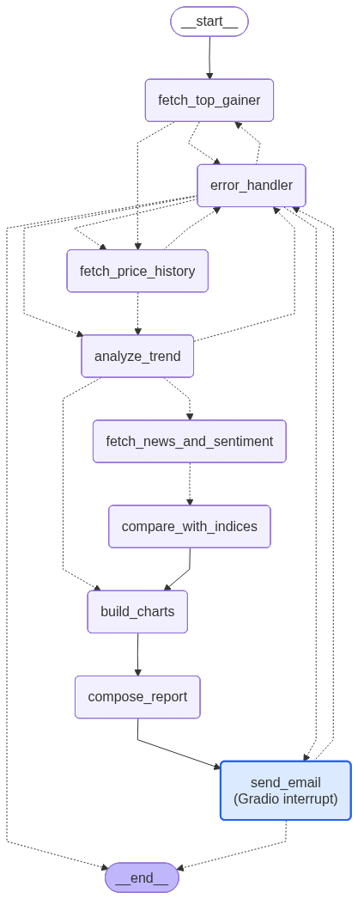

# NASDAQ BeStock Analyzer

A LangChain + LangGraph agent that automatically identifies the best-performing NASDAQ stock of the day, analyses its recent performance, generates charts, and delivers a formatted report to your inbox.

---

## Features


| Feature                          | Details                                                                                                                     |
| -------------------------------- | --------------------------------------------------------------------------------------------------------------------------- |
| **Top gainer detection**         | Scans the NASDAQ market daily with filters: price ≥ $10, volume ≥ 500 K, gain ≥ 5 %, symbol ≤ 4 chars, relative volume ≥ 2× |
| **Price history analysis**       | Avg daily change, trend classification (uptrend / downtrend / pullback / sideways), configurable lookback (3 – 30 days)     |
| **Sentiment analysis**           | News crawl (Brave Search → SerpAPI) + LLM classification; query refinement retries sparse searches automatically            |
| **S&P 500 comparison**           | Period return, relative performance, and beta vs `^GSPC`                                                                    |
| **Volatility**                   | N-day return standard deviation; shown only when the Volatility toggle is enabled                                           |
| **Buy / Hold / Sell suggestion** | LLM-generated (or rule-based fallback) when Advanced Settings is on                                                         |
| **Charts**                       | Matplotlib PNG: price trend, daily changes, index comparison, sentiment gauge — attached to the email                       |
| **Email delivery**               | SMTP (Gmail-compatible); HTML + plain-text multipart; chart attachments                                                     |
| **Gradio UI**                    | Web app at `http://localhost:7860`                                                                                          |
| **CLI**                          | `bestock` command for scripted / CI runs                                                                                    |
| **Observability**                | Structured logging, LangSmith tracing (optional)                                                                            |
| **Fallback chain**               | 20s same-provider backoff on rate limits, then Alpha Vantage → yfinance for price data; Brave → SerpAPI for news            |


---

## Project Structure

```
sleekflow-assignment/
├── README.md
├── pyproject.toml          # dependency manifest + entry points
├── .env                    # secrets — never commit
├── .env.example            # template (copy to .env)
├── outputs/
│   ├── charts/             # generated PNG charts
│   └── reports/            # (reserved for future text exports)
├── src/bestock_agent/
│   ├── __init__.py         # LangSmith tracing activation
│   ├── app.py              # Gradio UI (launch module)
│   ├── cli.py              # CLI entry point
│   ├── config.py           # pydantic-settings Settings
│   ├── graph.py            # LangGraph StateGraph assembly
│   ├── logging.py          # structured BestockLogger
│   ├── schemas.py          # Pydantic data models
│   ├── state.py            # BestockState TypedDict + initial_state()
│   ├── chains/
│   │   ├── query_refinement_chain.py   # Phase 7: refine sparse news queries
│   │   ├── report_chain.py             # LLM email report composition
│   │   └── sentiment_chain.py          # LLM sentiment classification
│   ├── nodes/              # LangGraph nodes (one file per node)
│   ├── providers/          # Alpha Vantage, yfinance, Brave, SerpAPI adapters
│   └── services/           # Pure-Python analysis, validation, charts, email
└── tests/                  # pytest test suite (105 tests)
```

---

## Architecture Overview

```
   Finnhub    ─┐                                  ┌─ Brave Search  ─┐
               │ fetch_top_gainer                 │                 │
yfinance (fb) ─┘      │                           │  SerpAPI (fb)  ─┘
                      ▼                            ▼
              fetch_price_history        fetch_news_and_sentiment
                      │                 (query refinement + LLM)
                      ▼                            │
               analyze_trend ─── advanced? ────────┘
                      │                            │
               build_charts ◄──────────── compare_with_indices
                      │
               compose_report  (LLM or template fallback)
                      │
               send_email (SMTP, chart attachments)
                      │
                     END ─── error_handler (retry / fallback)
```

---

## Architecture Diagram



---

## Requirements

- Python **3.11+**
- API keys (see [Secrets](#secrets))
- A Gmail account (or any SMTP server) for email delivery
- Internet access during runtime

---

## Setup

### 1. Clone and create a virtual environment

```bash
git clone <repo-url>
cd sleekflow-assignment
python -m venv .venv
source .venv/bin/activate          # Windows: .venv\Scripts\activate
```

### 2. Install dependencies

```bash
pip install -e ".[dev]"
```

Or with [uv](https://github.com/astral-sh/uv):

```bash
uv pip install -e ".[dev]"
```

### 3. Configure secrets

Copy `.env.example` to `.env` and fill in all `<YOUR-*>` placeholders:

```bash
cp .env.example .env
```


| Variable                     | Required | Description                                                                         |
| ---------------------------- | -------- | ----------------------------------------------------------------------------------- |
| `OPENAI_API_KEY`             | Yes      | OpenAI key for report, sentiment, and query-refinement chains                       |
| `OPENAI_MODEL`               | optional | Model name (default: `gpt-5.4-mini`)                                                 |
| `ALPHAVANTAGE_API_KEY`       | Yes      | [Alpha Vantage](https://www.alphavantage.co/support/#api-key) free key              |
| `BRAVE_API_KEY`              | optional | [Brave Search API](https://api.search.brave.com) key for news                       |
| `SERPAPI_API_KEY`            | optional | [SerpAPI](https://serpapi.com) key (news fallback)                                  |
| `SMTP_HOST`                  | Yes      | e.g. `smtp.gmail.com`                                                               |
| `SMTP_PORT`                  | Yes      | `587` (TLS) or `465` (SSL)                                                          |
| `SMTP_USER`                  | Yes      | Sender email address                                                                |
| `SMTP_PASSWORD`              | Yes      | App password (Gmail: Settings → Security → App passwords)                           |
| `DEFAULT_EMAIL_RECIPIENT`    | Yes      | Fallback recipient when none is entered in the UI                                   |
| `DEFAULT_LOOKBACK_DAYS`      | optional | Default history window (default: `5`)                                               |
| `RATE_LIMIT_BACKOFF_SECONDS` | optional | Delay before retrying the same provider after a rate-limit response (default: `20`) |
| `LANGSMITH_TRACING`          | optional | Set to `true` to enable LangSmith tracing                                           |
| `LANGSMITH_API_KEY`          | optional | LangSmith API key                                                                   |
| `LANGSMITH_PROJECT`          | optional | Project name (default: `bestock-agent`)                                             |


> **Gmail App Password** — Regular passwords will not work with SMTP. Generate a 16-character app password at [myaccount.google.com → Security → 2-Step Verification → App passwords](https://myaccount.google.com/apppasswords).

---

## Running the Agent

### Option A — Gradio Web UI

```bash
python -m bestock_agent.app
# or:
bestock-ui
```

Open [http://localhost:7860](http://localhost:7860) in your browser.

**UI controls:**

1. Enter a valid **Email Recipient** address.
2. Click **▶ Start** for a quick run (5-day lookback, no advanced analysis).
3. Tick **Advanced Settings** to reveal:
  - **Lookback Days** (3 – 30, required when Advanced Settings is on)
  - **Sentiment Analysis** — classifies market mood from recent news
  - **S&P 500 Comparison** — compares stock vs index over the lookback period
  - **Volatility** — adds daily standard-deviation metric to the report

### Option B — CLI

```bash
bestock                                   # defaults from .env
bestock --days 10 --recipient user@example.com
bestock --advanced                        # enables all advanced analysis
bestock --provider yfinance               # force yfinance provider
bestock --date 2026-06-10                 # analyse a specific past date
```

Full options:

```
usage: bestock [-h] [--date DATE] [--days DAYS] [--recipient RECIPIENT]
               [--advanced] [--provider {alphavantage,yfinance}]

  --date        Target date YYYY-MM-DD (default: today)
  --days        Lookback trading days, 3–30 (default: from .env)
  --recipient   Email recipient address (default: DEFAULT_EMAIL_RECIPIENT)
  --advanced    Enable sentiment, volatility, and index comparison
  --provider    Force a specific data provider (default: alphavantage)
```

---

## Running Tests

```bash
# All tests (no external API calls — all providers are mocked)
pytest

# Verbose with test names
pytest -v

# A specific test file
pytest tests/test_happy_flow.py -v

# With log output (useful for debugging)
pytest -s --log-cli-level=INFO
```

### Test coverage summary


| File                       | What it covers                                                                                         |
| -------------------------- | ------------------------------------------------------------------------------------------------------ |
| `test_analysis.py`         | Trend calculations, volatility, price table formatting                                                 |
| `test_validation.py`       | All validation rules (email, date, lookback, price bars, top gainer)                                   |
| `test_fallback.py`         | Provider switching, retry logic, `decide_fallback`, `failing_node`                                     |
| `test_graph_routing.py`    | Node routing functions, `error_handler` node behaviour                                                 |
| `test_report_payload.py`   | Report composition, disclaimer, conditional volatility/suggestion                                      |
| `test_query_refinement.py` | LLM and rule-based query refinement                                                                    |
| `test_logging.py`          | Structured logger helpers and timer                                                                    |
| `test_happy_flow.py`       | Full graph happy paths (basic + advanced), email delivery flag, fallback recovery, UI input validation |


---

## Expected Output Artifacts

After a successful run:

- **Email** delivered to the recipient with subject `BeStock's Top Performing NASDAQ Stock Analysis Report on <SYMBOL> (<DATE>)`
- **Charts** saved to `outputs/charts/`:
  - `<symbol>_price_<date>.png` — closing price trend
  - `<symbol>_change_<date>.png` — daily percentage change bars
  - `<symbol>_vs_sp500_<date>.png` — stock vs S&P 500 (advanced only)
  - `<symbol>_sentiment_<date>.png` — sentiment gauge (advanced only)

The email contains:

1. **Disclaimer** at the top
2. **Greetings**
3. Stock name, symbol, close, today's change %
4. Price history table
5. Trend summary (average change, trend label)
6. Daily Volatility (if Volatility enabled)
7. Sentiment (if Sentiment Analysis enabled)
8. S&P 500 comparison (if S&P 500 Comparison enabled)
9. Buy / Hold / Sell suggestion (if any Advanced Setting enabled)
10. Regards sign-off

---

## Observability

### Application logging

The agent logs structured events to stderr by default. Control the format:

```bash
LOG_LEVEL=DEBUG python -m bestock_agent.app
LOG_FORMAT=json bestock --advanced       # JSON-formatted log lines
```

Key log events: `provider_call`, `provider_fallback`, `rate_limit_backoff_wait`, `validation_failure`, `token_usage`, `email_sent`, `query_refined`, `retry_scheduled`, `node_error`.

### LangSmith tracing

Enable full LangChain / LangGraph trace capture:

```dotenv
LANGSMITH_TRACING=true
LANGSMITH_API_KEY=lsv2_pt_...
LANGSMITH_PROJECT=bestock-agent
```

Traces appear in [smith.langchain.com](https://smith.langchain.com) under the configured project, showing every LLM call, token usage, and node latency.

---

## Licence

MIT